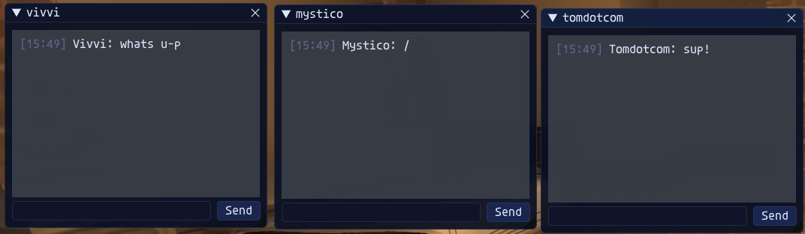
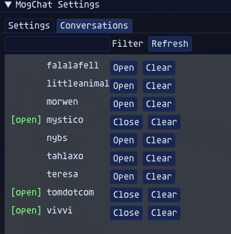
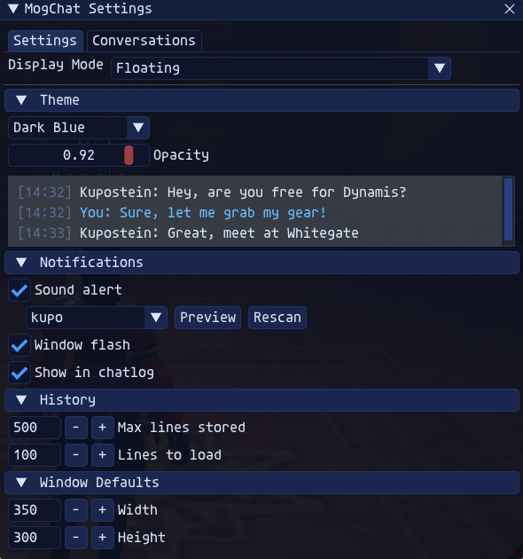

# MogChat - FFXI Tell Messenger

An Ashita v4 addon for FFXI that provides an instant messenger-style interface for tells. Pop-up chat windows for each conversation, persistent history, customizable notifications, and themeable UI.

<p align="center">
  
</p>

## Features

- Individual chat windows per conversation (like AIM/ICQ)
- Two display modes: floating windows or tabbed single window
- Persistent chat history per character, loaded on reopen
- Configurable sound notifications with 12 bundled sounds and a preview button
- Window flash and chatlog echo toggles
- 6 built-in themes: FFXI Gold, Dark Blue, Dark Mode, Mog Green, Clean Light, Default
- Opacity slider for window transparency
- New tell windows center on screen, then remember position after you drag them
- Smart auto-scroll that won't interrupt you while reading history
- ImGui settings window with live theme preview

## Installation

1. Download the latest release from [Releases](https://github.com/glitchv0/mogchat/releases)
2. Extract the `mogchat` folder into your Ashita `addons/` directory
3. In-game: `/addon load mogchat`

To auto-load on startup, add to your Ashita scripts/default.txt:
```
/addon load mogchat
```

## Usage

- `/mogchat` - Toggle the settings window
- `/mogchat mode [floating|tabbed]` - Switch display mode
- `/mogchat sound [on|off]` - Toggle sound notifications
- `/mogchat flash [on|off]` - Toggle window flash
- `/mogchat echo [on|off]` - Toggle chatlog echo
- `/mogchat clear <name>` - Clear history for a player
- `/mogchat clearall` - Clear all history
- `/mogchat close` - Close all chat windows
- `/mogchat help` - Show all commands

## Sounds

MogChat comes with 12 notification sounds. Drop any `.wav` file into the `sounds/` folder and hit **Rescan** in settings to add your own.

Bundled sounds: ding, double_ding, boop, chime, pop, notify, gentle, victory, hey_listen, crystal, kupo, kweh

## Themes

Select a theme from the settings dropdown. The live preview panel shows how messages will look before you commit.

| Theme | Description |
|-------|-------------|
| FFXI Gold | Dark with warm gold accents (default) |
| Dark Blue | Deep navy with cool blue accents |
| Dark Mode | Clean neutral dark grey |
| Mog Green | Dark forest green |
| Clean Light | Light mode for readability |
| Default | Minimal dark grey |

## Screenshots

**Conversation History**

<p>
  
</p>

**Settings window**

<p>
  
</p>

## Issues / Feedback

- **GitHub Issues**: [github.com/glitchv0/mogchat/issues](https://github.com/glitchv0/mogchat/issues)
- **Discord**: DM **glitchv0**
